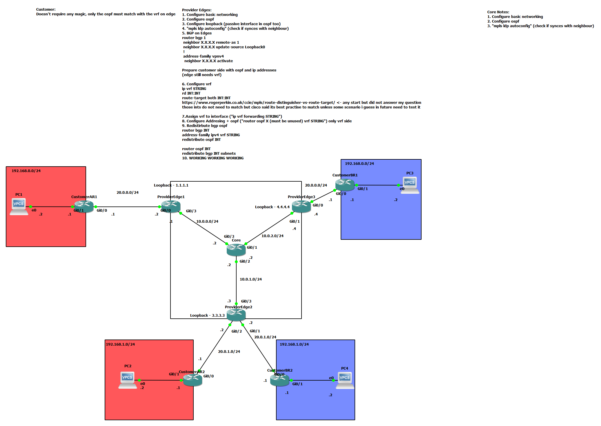

# MPLS

Managed to set it up successfully. Both customers use the same subnets (192.168.0.0/24 and 192.168.1.0/24).  

I understand concept of mpls, but there are some things that would need to be cleared.
1. Play around with route distinguishers and see exactly what they do
2. Configure it manually without BGP and OSPF and see what it takes
3. I saw that MPLS vpn was mentioned (This one is going too far ahead for no reason not going to be done in foreseeable future )