# BitLocker Scenario
In this scenario i am assuming that a company due to regulations have to move to encrypted drives (therefore the BitLocker). 

The Company is small to medium-sized around 100 laptops and 500 work stations. It would be infeasible for IT technician to come to every single PC to setup the bitlocker hence it must be scripted.

There must a simple way of identifying which pc's are not running under bitlocker so it can be investigated.

TODO:
1. There is something called MBAM i definitely to check it out under the same scenario

# The Plan
- Recovery Keys are stored through agent 
- Workstations are unlocked only via network unlock
- Laptops due to fact they are movable and personal should be unlocked via TPM+PIN and Network Unlock for convenience 
- Laptops without TPM must have a randomly generated password 
- Workstations TPM will be identified and replaced 

## Setting up Recovery Agent
For it, I have followed this [tutorial](https://www.rezab.eu/intune/2023/08/14/bitlocker-certificate-dra-managed-by-intune-html/)  
1. Under "Certificate Templates Console" duplicate "Key Recovery Agent"   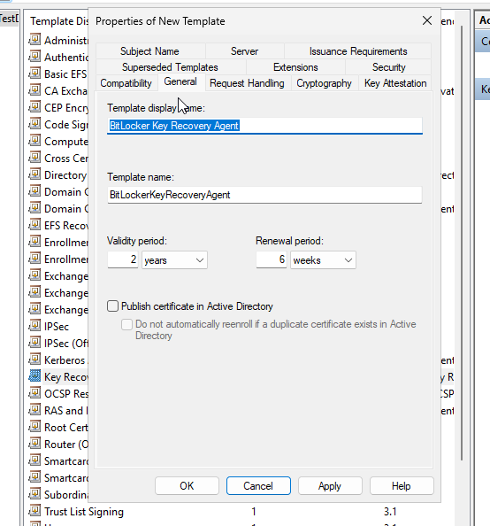
2. Name New template accordingly   
3. Go to Extensions and edit "Application Policies". Then add two of the following:
   - Bitlocker Drive Encryption: 1.3.6.1.4.1.311.67.1.1
   - Bitlocker Data Recovery Agent: 1.3.6.1.4.1.311.67.1.2\
   In my case i had to manually add them which was really easy just click new and provide the values. The result should look like that.
     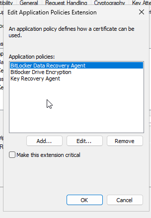
4. Go to the CA and enable the certificate
  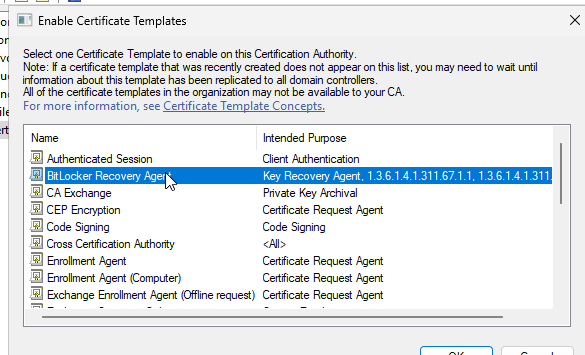
5. Request the certificate, issue the certificate and then export it. 
  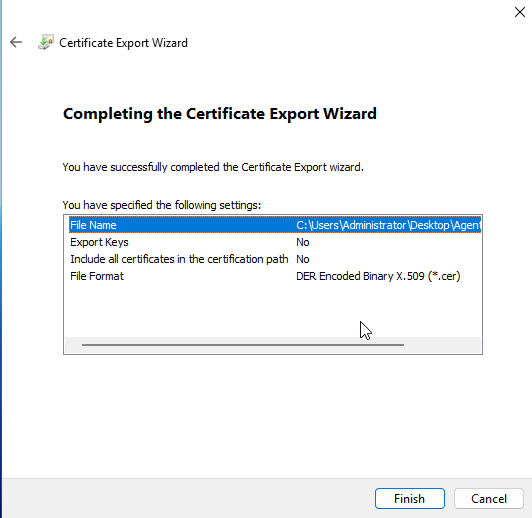
6. Create the GPO for it
  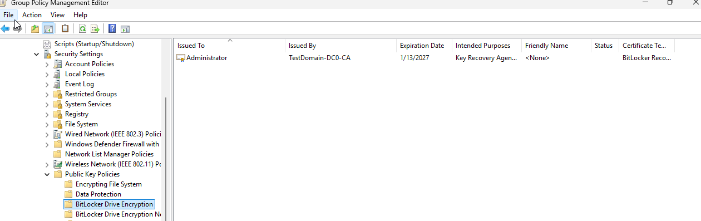
Additionally this also needs to be configured 
  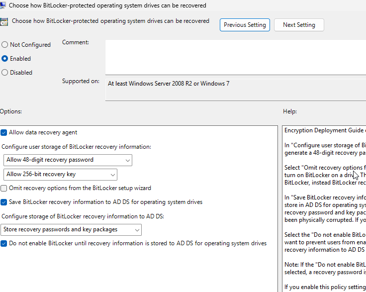

## Setting up Network Unlock
For it, I have followed microsoft documentation [link](https://learn.microsoft.com/en-us/windows/security/operating-system-security/data-protection/bitlocker/network-unlock)
  To set up the certificate the process is pretty much the same as for the agent 

1. Duplicate the User Template (Previously it was Key Recovery Agent)
2. Set "Certification Authority and Certificate recipient fields to Windows Server 2016 and Windows 10"
  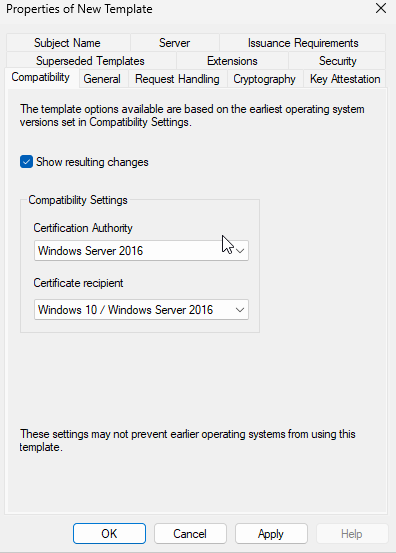
3. Under "General" Change the template name and clear the checkbox for "Publish in active directory"
  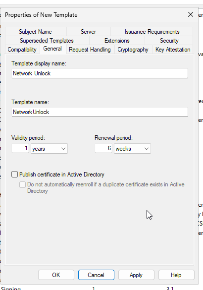
4. Under "Request Handling" select Purpose to be Encryption and Make sure that private key can be exported
  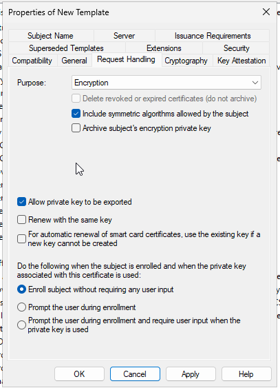
5. Under "Cryptography" make sure that minimum key size is 2048 and in docs it says to select "Microsoft Software Key Storage Provider" to do that make sure that "Provider Category" is set to not Legacy and Then the "Requesters must use one of the following providers"
  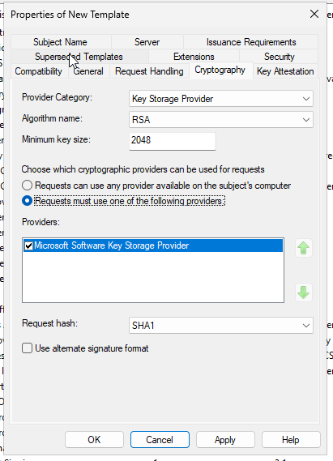
6. Under "Subject Name" select "Supply in the request" it will pop a warning just click OK
7. Under "Issuance Requirements" select "CA certificate manager approval" and "Valid existing certificate"
  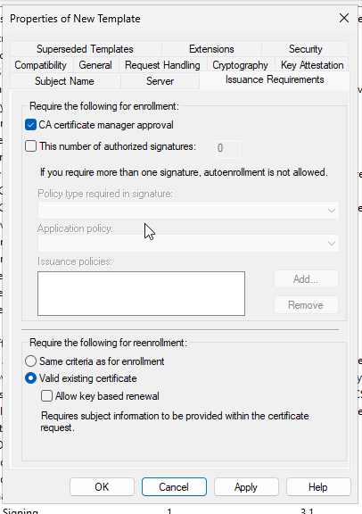
8. Under "Extensions" and "Application Policies" remove all the default options and add  
   Name: BitLocker Network Unlock  
   Object Identifier: 1.3.6.1.4.1.311.67.1.1  
9. Still in the "Extensions" tab edit "Key Usage", in my case the correct options were selected but in docs it says to make sure that "Make this extensions critical" and "Allow key exchange only with key encryption (key encipherment)" are selected
  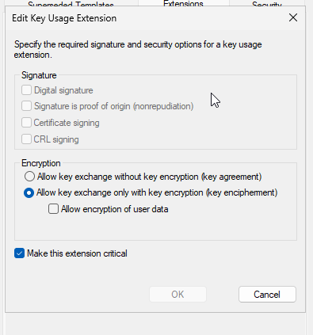
10. Go back to the CA and add the Network Unlock template
11. Request the certificate, because the subject name is to provide in request, we get a fat yellow warning
  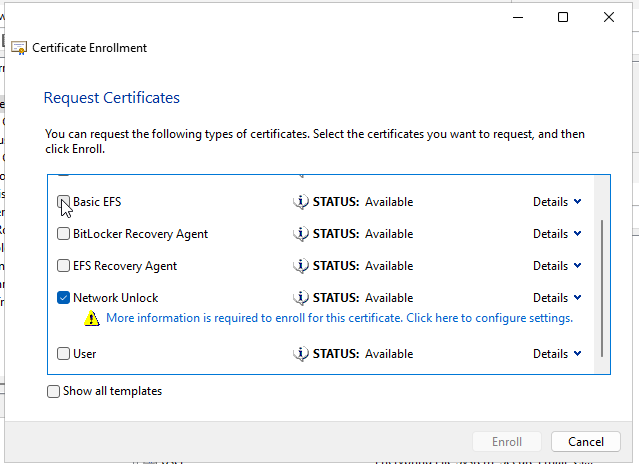
This is not a problem what we need to do is select the common name and add it in my case I added "BitLocker Network Unlock Certificate for TestDomain.local"
  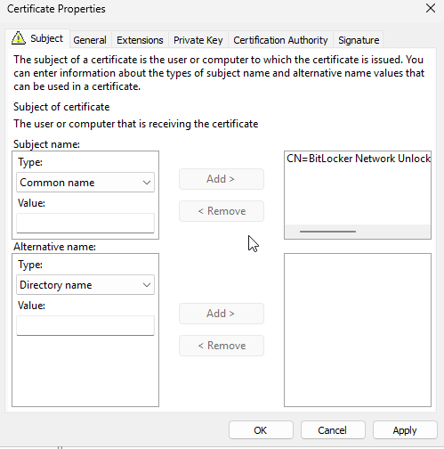
Also in docs they say to change the Friendly Name, and it's under "General" Tab
12. Issue the certificate, export 2 versions of this certificate one with Private Key and one without.
  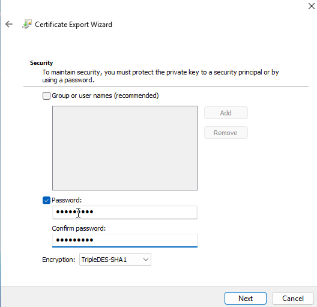
13. Import the certificate with Private Key to the WDS server, you must import it to the computer no to the user
  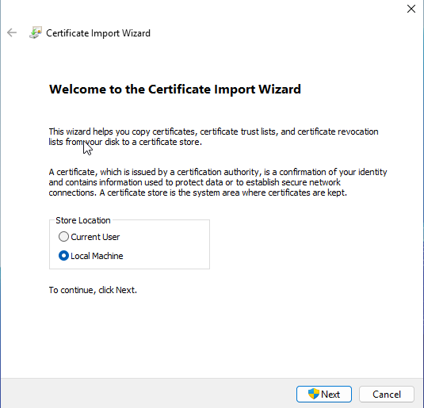
Also, you need to specify the store where it will be placed
  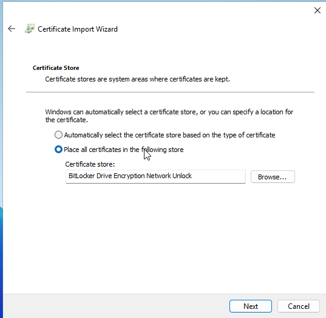
14. Create the GPO, changed only those two policies on screenshot. 
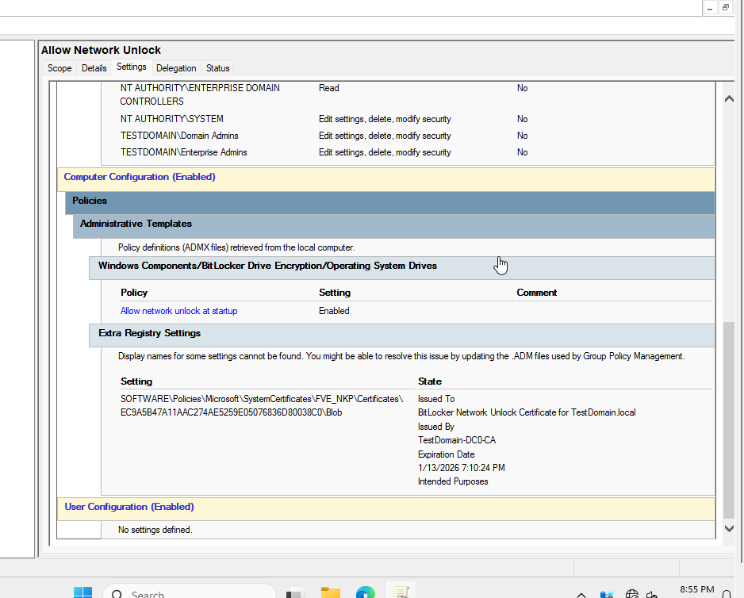

## Deploying BitLocker to Workstations

## Deploying Bitlocker to Laptops
 