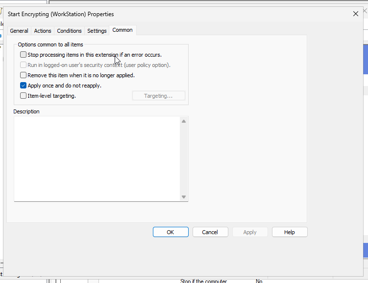

# BitLocker Scenario
In this scenario i am assuming that a company due to regulations have to move to encrypted drives (therefore the BitLocker). 

The Company is small to medium-sized around 100 laptops and 500 work stations. It would be infeasible for IT technician to come to every single PC to setup the bitlocker hence it must be scripted.

There must a simple way of identifying which pc's are not running under bitlocker so it can be investigated.

TODO:
1. There is something called MBAM i definitely to check it out under the same scenario

# The Plan
- Recovery Keys are stored through agent ✅
- Workstations are unlocked only via network unlock ✅
- Laptops due to fact they are movable and personal should be unlocked via TPM+PIN and Network Unlock for convenience ✅
- Laptops without TPM must have a randomly generated password ✅
- Workstations without TPM will be identified and replaced 

# Lab Setup
 <br>
- DC0 installed with Domain Services, Certification Authority, DHCP, DNS
- DC1 installed with WDS and joined to domain.


## Setting up Recovery Agent
For it, I have followed this [tutorial](https://www.rezab.eu/intune/2023/08/14/bitlocker-certificate-dra-managed-by-intune-html/) <br>
1. Install feature "Bitlocker Drive Encryption" 
 <br>
It will provide a tab under Computer properties to see the recovery password so we can check if it works.
 <br>
2. Under "Certificate Templates Console" duplicate "Key Recovery Agent" <br> 
3. Name New template accordingly <br> 
4. Go to Extensions and edit "Application Policies". Then add two of the following:
   - Bitlocker Drive Encryption: 1.3.6.1.4.1.311.67.1.1
   - Bitlocker Data Recovery Agent: 1.3.6.1.4.1.311.67.1.2\
   In my case i had to manually add them which was really easy just click new and provide the values. The result should look like that.
   <br> 
5. Go to the CA and enable the certificate
<br> 
6. Request the certificate, issue the certificate and then export it. 
<br> 
7. Create the GPO for it
<br> 
Additionally this also needs to be configured 
<br> 


## Setting up Network Unlock
For it, I have followed microsoft documentation [link](https://learn.microsoft.com/en-us/windows/security/operating-system-security/data-protection/bitlocker/network-unlock)
<br> To set up the certificate the process is pretty much the same as for the agent 
1. Install Windows Deployment Services and "BitLocker Network Unlock" feature, for configuration of WDS i pretty much clicked next for everything. <br> 
<mark>The important thing is that the WDS server must be different from DHCP server other wise the network unlock won't work. (It says it in docs and i did this way and was wondering for long time why it doesn't work)</mark> <br>

2. Duplicate the User Template (Previously it was Key Recovery Agent)
3. Set "Certification Authority and Certificate recipient fields to Windows Server 2016 and Windows 10"
<br> 
4. Under "General" Change the template name and clear the checkbox for "Publish in active directory"
<br> 
5. Under "Request Handling" select Purpose to be Encryption and Make sure that private key can be exported
<br> 
6. Under "Cryptography" make sure that minimum key size is 2048 and in docs it says to select "Microsoft Software Key Storage Provider" to do that make sure that "Provider Category" is set to not Legacy and Then the "Requesters must use one of the following providers"
<br> 
7. Under "Subject Name" select "Supply in the request" it will pop a warning just click OK
8. Under "Issuance Requirements" select "CA certificate manager approval" and "Valid existing certificate"
<br> 
9. Under "Extensions" and "Application Policies" remove all the default options and add <br>
   Name: BitLocker Network Unlock <br>
   Object Identifier: 1.3.6.1.4.1.311.67.1.1 <br>
10. Still in the "Extensions" tab edit "Key Usage", in my case the correct options were selected but in docs it says to make sure that "Make this extensions critical" and "Allow key exchange only with key encryption (key encipherment)" are selected
<br> 
11. Go back to the CA and add the Network Unlock template
12. Request the certificate, because the subject name is to provide in request, we get a fat yellow warning
<br> 
This is not a problem what we need to do is select the common name and add it in my case I added "BitLocker Network Unlock Certificate for TestDomain.local"
<br> 
Also in docs they say to change the Friendly Name, and it's under "General" Tab
13. Issue the certificate, export 2 versions of this certificate one with Private Key and one without.
<br> 
14. Import the certificate with Private Key to the WDS server, you must import it to the computer not to the current user
<br> 
Also, you need to specify the store where it will be placed
<br> 
15. Create the GPO, changed only those two policies on screenshot. 


## Deploying
Create a public share for scripts <br>

### To Workstations
For workstations i created an immediate task via GPO, with the following settings
<br> 
``powershell.exe -ExecutionPolicy "bypass" -NoProfile -Command \\dc0.testdomain.local\PublicScripts\Workstation.ps1``
<br> 
<br> 
<br> 
<br> 
The script used is:
```
try {
    $isTPMInitialized = $(Get-TPM).TPMReady

    if(!$isTPMInitialized){
        Initialize-Tpm
    }
} catch {
    return;
}

$isCEncrypted = $(Get-BitLockerVolume C:).ProtectionStatus -eq "On"

if($isCEncrypted){
    return;
}

Enable-BitLocker -MountPoint "C:" -RecoveryPasswordProtector

$BLV = Get-BitLockerVolume -MountPoint "C:"
$BLV.KeyProtector | ForEach-Object {
    if($_.KeyProtectorType -eq "Tpm"){
        Remove-BitLockerKeyProtector -MountPoint "C:" -KeyProtectorId $_.KeyProtectorId
    }
}

shutdown /r -txx 180
```
In summary, if workstation has tpm, encrypt it and remove TPM unlock (so it can be only unlocked via network or with recovery password), which is exactly what i want. And if workstation does not have tpm this will fail which is what I wanted.
### To Laptops
There is one additional GPO that was required to configure to allow tpm+pin and password. 

Aside of that here is my configured task.


<br>The powershell action is the same as for workstations but it points to Laptops.ps1, also the second action removes the scheduled task, without it, on every single logon bit locker would re-encrypt


The script used is:
```
$isCEncrypted = $(Get-BitLockerVolume C:).ProtectionStatus -eq "On"
if($isCEncrypted){
    return;
}
$isTpmPresent = $False
try {
    $isTpmPresent = $(Get-TPM).TPMPresent
} catch {

}

$passwordToUser = "NULL"

if($isTpmPresent){
    if(!$(Get-TPM).TPMReady){
        Initialize-Tpm
    }
    $pin = (Get-Random -Minimum 100000 -Maximum 999999).ToString()
    $passwordToUser = $pin
    $secured = ConvertTo-SecureString -AsPlainText -Force $pin

    Add-BitLockerKeyProtector -MountPoint "C:" -TpmAndPinProtector $secured
    Enable-BitLocker -MountPoint "C:" -RecoveryPasswordProtector
} else {

    $randomPasswordString = -join ((65..90)+(97..122) | Get-Random -Count 9 | %{[char]$_})
    $passwordToUser = $randomPasswordString
    $secure = ConvertTo-SecureString -AsPlainText -Force $randomPasswordString

    Add-BitLockerKeyProtector -MountPoint "C:" -RecoveryPasswordProtector
    Enable-BitLocker -MountPoint "C:" -PasswordProtector $secure
}


$toUserMsg = "*formal message* at the end of message a password will be provided, please memorize the password, do not write it down, do not tell anyone about it, The password is: " + $passwordToUser.ToString()
msg * $toUserMsg
shutdown /r /txx 500
```

### Testing 
#### Workstation with TPM

<br><mark>Towards end of gif i checked if network unlock is working by disconnecting from network, and it clearly asked for recovery, when plugging it back, it booted no issues</mark>
#### Workstation without TPM

<br>Nothing happend as expected 
#### Laptop with TPM

<br> I received pin was able to unlock with with the pin, also the network unlock works
#### Laptop without TPM
 
 <br> I receive password, network unlock doesn't work because it requires tpm, which was expected