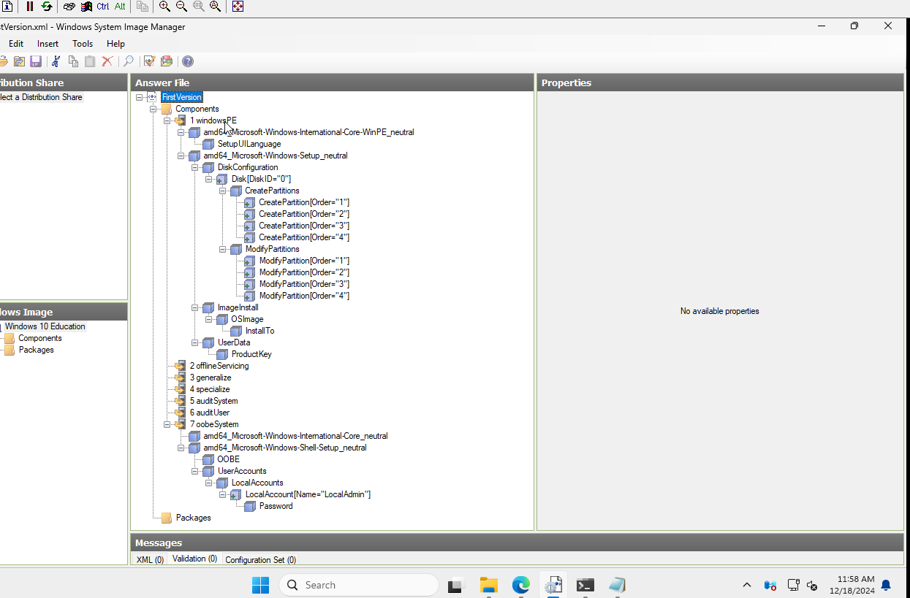

# Tldr
I want to play around with windows automatic installs and want to see what i can do. From what i understand there are 3 options
1. .iso with autounattend.xml
2. Pxe boot with WinPE (still using autounattend.xml)
3. Windows Deployment Services (Didn't use it before)

The disclaimer is i only intend it to work on UEFI

## Creation of basic unattended xml
I followed this [tutorial](https://www.windowscentral.com/how-create-unattended-media-do-automated-installation-windows-10)
 
1. Download ADK for your target version i have used [windows 10](https://learn.microsoft.com/en-us/windows-hardware/get-started/adk-install)
2. Using Windows System Image Manager import your target image i have used Education Version
3. Add Components, from what i have seen the component names changed slightly since the tutorial have released but i was still able to find them for my version   Pass 1 Windows PE - International-Core-WinPE_neutral, Windows-Setup_neutral   Pass 7 oobeSystem - International-Core_neutral, Shell-Setup_neutral   I really suggest to use ctrl+f there.
4. Configure the components, there is lots of additional stuff that don't need to be configured, the tutorial i linked provides the bare minimum that will work. It makes a lot of sense when you configure it but there are weird quirks such as configuring the partitions.
 After it should look like that

5. Save it.

## Creating iso with autounattend.xml
Maybe what i did was not the simplest or best option
1. I extracted iso with winrar to folder
2. I added the autounattend.xml generated by Windows System Image Manager
3. I used oscdimg to create bootable iso from folder, the command i provide allows only for boot on UEFI
>oscdimg.exe -m -o -u2 -udfver102 -bootdata:2#p0,e,b(iso folder)\boot\etfsboot.com#pEF,e,b(iso folder)\efi\microsoft\boot\efisys.bin (destination).iso
4. It works

