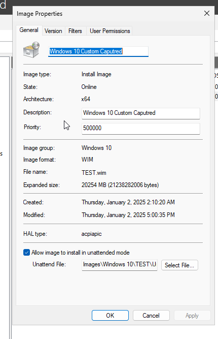

# Unattended Installs
There is highly likelihood of me missing something
1. .iso with autounattend.xml ✅
2. PXE with WinPE
   - WinPE Setup.exe ✅
   - WinPE Dism ✅
3. Windows Deployment Services
    - WDS ✅
    - MDT ❌ (Need to still try it)

Additionally
1. Capture and Apply custom windows Image
   - WDS ✅
   - Manually ✅

The disclaimer is I only try things on UEFI.

## Creation of basic unattended xml
I followed this [tutorial](https://www.windowscentral.com/how-create-unattended-media-do-automated-installation-windows-10)
<br>
1. Download ADK for your target version i have used [windows 10](https://learn.microsoft.com/en-us/windows-hardware/get-started/adk-install)
2. Using Windows System Image Manager import your target image i have used Education Version
3. Add Components, from what i have seen the component names changed slightly since the tutorial have released but i was still able to find them for my version <br> Pass 1 Windows PE - International-Core-WinPE_neutral, Windows-Setup_neutral <br> Pass 7 oobeSystem - International-Core_neutral, Shell-Setup_neutral <br> I really suggest to use ctrl+f there.
4. Configure the components, there is lots of additional stuff that don't need to be configured, the tutorial i linked provides the bare minimum that will work. It makes a lot of sense when you configure it but there are weird quirks such as configuring the partitions.
<br>After it should look like that

5. Save it.

## Creating iso with autounattend.xml
Maybe what i did was not the simplest or best option
1. I extracted iso with winrar to folder
2. I added the autounattend.xml generated by Windows System Image Manager
3. I used oscdimg to create bootable iso from folder, the command i provide allows only for boot on UEFI
    >oscdimg.exe -m -o -u2 -udfver102 -bootdata:2#p0,e,b(iso folder)\boot\etfsboot.com#pEF,e,b(iso folder)\efi\microsoft\boot\efisys.bin (destination).iso
4. It works


## PXE with WinPE
From what i understand there are two options there. Use setup.exe or DISM
### Setting up WinPE
I followed [this document](https://learn.microsoft.com/en-us/windows/deployment/configure-a-pxe-server-to-load-windows-pe) from microsoft. It's pretty much copy and paste.
```
copype.cmd amd64 C:\winpe_amd64
dism.exe /mount-image /imagefile:c:\winpe_amd64\media\sources\boot.wim /index:1 /mountdir:C:\winpe_amd64\mount
copy c:\winpe_amd64\mount\windows\boot\pxe\*.* y:\Boot
copy C:\winpe_amd64\media\boot\boot.sdi y:\Boot
copy C:\winpe_amd64\media\Boot\Fonts y:\Boot\Fonts
bcdedit.exe /createstore c:\BCD
bcdedit.exe /store c:\BCD /create {ramdiskoptions} /d "Ramdisk options"
bcdedit.exe /store c:\BCD /set {ramdiskoptions} ramdisksdidevice boot
bcdedit.exe /store c:\BCD /set {ramdiskoptions} ramdisksdipath \Boot\boot.sdi
```
>bcdedit.exe /store c:\BCD /create /d "winpe boot image" /application osloader

The command above will provide {GUID1} you just replace it

```
bcdedit.exe /store c:\BCD /set {GUID1} device ramdisk=[boot]\Boot\boot.wim,{ramdiskoptions} 
bcdedit.exe /store c:\BCD /set {GUID1} path \windows\system32\winload.exe 
bcdedit.exe /store c:\BCD /set {GUID1} osdevice ramdisk=[boot]\Boot\boot.wim,{ramdiskoptions} 
bcdedit.exe /store c:\BCD /set {GUID1} systemroot \windows
bcdedit.exe /store c:\BCD /set {GUID1} detecthal Yes
bcdedit.exe /store c:\BCD /set {GUID1} winpe Yes
bcdedit.exe /store c:\BCD /create {bootmgr} /d "boot manager"
bcdedit.exe /store c:\BCD /set {bootmgr} timeout 30 
bcdedit.exe /store c:\BCD -displayorder {GUID1} -addlast
copy c:\BCD y:\Boot\BCD
```
The only thing that is important there is that winload.exe is for bios, if you want efi (like in my case) you need to have winload.efi, make sure to change it accordingly, also make sure it's in directory, in my case commands provided by microsoft copied the file. If not just search it in explorer.

>dism /unmount-image /mountdir:c:your_boot_dir\mount
>
Also at the end of this step i used the following command, because in the commands it says to mount it, but it does not mention to unmount. Just a cleanup task

### Setting Actual PXE
Now this is where i encountered some issues.
1. I thought about using WDS's tftp for it, but it looks like it was not intended to be used this way. I might be incorrect with this one but i looked at it and just didn't feel correct.
2. I tried to setup ArchLinux with dnsmasq, I had success previously with pxe booting Arch through it, so I tried WinPE. Upon correctly configuring the PXE it was booting partially.  

<br><br> No matter what I did to it, it just didn't want to play. But the fact that it was doing something got me curios. Upon further investigation i saw that the paths were mixed with Windows forward slashes and unix's backslashes. 

I decided to ditch it.
There are two probable solutions 1. There is weird option in XYZ tftp server to resolve paths correctly 2. It's something to do with WinPE itself like in a setup step or something like that (unlikely). But testing multiple tftp servers just for that when i will ditch this PXE setup after sucessful install seems not worth it.
<br><br> I also tried to use tftpd64 on windows just for tftp, on the microsoft website it clearly mentions that option 66 allows to select server ip that will be used for tftp. So I tried it

This is the following result

Yea not a lot of success.
3. Yea so fully using tftpd64 just works 
<br>This is my config<br>


>The important note here is that bootmgfw.efi was not copied by microsoft commands you had to find it. And it boots into uefi, if you want bios you need to have bootmgr.exe or bootsomething.com (there is only one .com file there). I don't remember. As I mentioned above I only care about uefi it works it works.


### Using Setup.exe 
1. Prepare share with extracted iso from Windows 10/11 and autounattend.xml
2. Mount boot.wim <br>
    >dism /mount-image /imagefile:c:\boot.wim /mountdir:c:\mounted
    <br>
3. Edit with notepad ``c:\mounted\Windows\system32\startnet.cmd``
<br>We just need mount our share and execute<br>

4. Unmount the image and save changes
    > dism /unmount-image /mountdir:c\mounted /commit
5. Should boot into WinPE and then automatically install windows.


### Using WinPE + DISM
The steps are similar to using setup.exe, The main difference being that we just do everything the manually, i guess this makes sense as we have more flexibility
The process looks something like that
1. Create partitions
2. Apply image 
3. Use bcdboot to create a bootloader 
4. Copy autounattend.xml so it actually is a 0 touch deployment

Here is what i did

1. Partitions.txt is from https://learn.microsoft.com/en-us/windows-hardware/manufacture/desktop/oem-deployment-of-windows-desktop-editions-sample-scripts?view=windows-11&preserve-view=true
2. Applying the image is from https://learn.microsoft.com/en-us/windows-hardware/manufacture/desktop/capture-and-apply-windows-using-a-single-wim?view=windows-11
3. For some reason copying unattended.xml to directories from https://learn.microsoft.com/en-us/windows-hardware/manufacture/desktop/windows-setup-automation-overview?view=windows-11#implicit-answer-file-search-order doesn't work. The only one that worked was C:\Unattend.xml (it says that Autounattend.xml should work but it didn't)


## Using WDS
1. Install dhcp and windows deployment services role and configure them (for WDS I installed it as standalone server and just clicked next for everything, my lab is not part of domain) 

2. Create a DHCP scope <br>

3. Extract .iso, using Windows Deployment Services add boot image (which would be inside sources\boot.wim), then add install image (sources\install.wim).

   (At this point you can PXE boot but you would need to click things manually, but it would allow to install windows 10 or whatever you got fully through network which is suprisingly easy)
4. Configure a separate xml with pass 1. I reused my old autounattend.xml and the only difference is that i added the "WindowsDeploymentServices" compontent and i removed InstallFrom/To from Windows-Setup_Neutral with whole pass 7 OOBE.
Also the "WindowsDeploymentServices" component needs to be configured but it was supriginsly easy.
<br><br>
    Under "ImageSelection" <br>
    InstallImage:
    - Filename: This would be in Windows Deployment Services and properties tab of your target image
    - ImageGroup: Again while adding install image you create group name. You just put it in there
    - Image Name: Under install images and in the propeties tab there is name. (It's not the file name, by default it would be Windows 10 Pro, Education etc)
    
    InstallTo:
    - DiskID: In my case 0
    - PartitionID: In my case 4 (the one that main ntfs partition is)
    
    Under "Login":
    - Yea, just provide domain, password login, all it does is on pxe boot it asks for password but when we provide password there it stops asking for the password. 
    
    
    After it's configured save it and tick "Enable unattended installation" and put your file into the correct architecture (for me, it was x64 UEFI)
    
5. Under Install Images in Windows Deployment Services go to the properties tab, Tick "Allow image to install in unattended mode" and select your xml. I used my old autounattend.xml It's important to mention the pass 1 from this xml won't be applied. As pass 1 is handled differently (by a step above)


6. Working


## Capturing Images
### Preparation of image
1. Clean installation of Windows 10
2. Installed gimp and shotcut
3. Used sysprep and left it <br>

### WDS
For WDS i followed this Guide https://msftwebcast.com/2020/02/sysprep-and-capture-a-windows-10-image-for-wds.html
1. Create a capture boot (under boot section right click and there will be option to create a capture) <br>
2. Boot it and capture the image I just prepared <br> 
3. Add the captured .wim file to the "Installation Images" tab, pretty much the same thing as adding the .wim file from extracted windows .iso

To actually make it fully unattended there are two more things that I had to do 
1. Tick the box and add my unattended.xml for OOBE <br> 
2. Edit pass 1 .xml The only difference is i had to change which image will it pull.


3. And it's working <br>
    

### DISM
I used the same prepared image
1. Boot into WinPE
2. (I mounted a network drive on G:, windows is mounted under W:) Use `dism /Capture-Image /ImageFile:G:\Custom.wim /captureDir:W:\ /Name:CustomImage`
3. The image is captured and is ready to use <br> 

To apply it in unattended fashion via WinPE as i did before the only difference to my original startnet.cmd is i changed filename and /Index to 1. It just works

